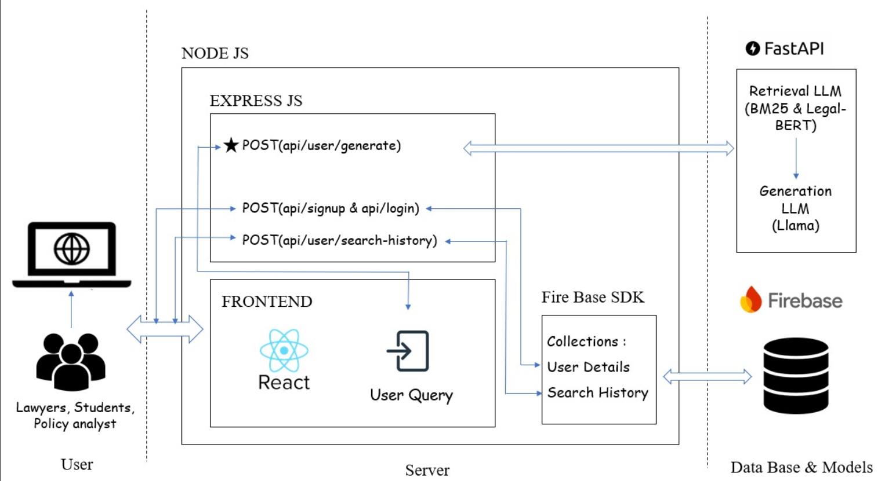

Case Bridge

**Status:** Currently working on the project.

## Description
This is the initial commit for our project. We are actively developing features, fixing bugs, and iterating based on milestones. More details will be added as progress is made.

## Architecture Diagram
Below is the high-level architecture diagram of the project. 

## Contributors and Milestones
The table below lists the contributors along with links to their milestone presentations and videos. (Note: If files are not yet available, I've used placeholders like "Coming soon" or sample links—update as you progress.)

| Name              | First Milestone PPT                  | First Milestone Video                | Second Milestone PPT                 | Second Milestone Video               |
|-------------------|--------------------------------------|--------------------------------------|--------------------------------------|--------------------------------------|
| Contributor 1    | [PPT Link](path/to/first-ppt1.pdf)  | [Video Link](path/to/first-video1.mp4) | [PPT Link](path/to/second-ppt1.pdf) | [Video Link](path/to/second-video1.mp4) |
| Contributor 2    | [PPT Link](path/to/first-ppt2.pdf)  | [Video Link](path/to/first-video2.mp4) | Coming soon                         | Coming soon                         |
| Contributor 3    | Coming soon                         | Coming soon                         | Coming soon                         | Coming soon                         |
| P HRITHIK RAJ   | [PPT](assets/hrithik/M1/CaseBridge-MS1-PPT.pdf)| [Video MS1](https://youtu.be/OM9up2UylJI)                        | Coming soon                         | Coming soon                         |
| Contributor 5    | Coming soon                         | Coming soon                         | Coming soon                         | Coming soon                         |

## Installation
1. Clone the repository: `git clone https://github.com/yourusername/your-repo.git`
2. Install dependencies: (Add commands here, e.g., `npm install` if it's a Node.js project.)
3. Run the project: (Add startup commands, e.g., `npm start`.)

