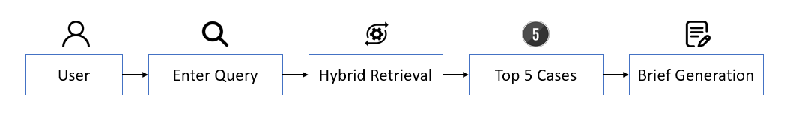

# CaseBridge 

## ✅ Achievements So Far
- **Curated Indian Case Law Dataset:** Collected and organized the **Indian Case Law Evaluation Corpus (ICLEC)**, available on [Kaggle](https://www.kaggle.com/datasets/hrithikraj2537/indian-case-law-evaluation-corpus-iclec).  
- **Prepared NLP-Ready Dataset:** Processed the corpus following the CLERC pipeline for machine learning tasks, now available on [Hugging Face](https://huggingface.co/datasets/HRITHIKRAJ2537H/ICLEC).  
- **Indexed Dataset for Retrieval Models:** Created a CLERC-style indexed dataset suitable for BM25 and other retrieval models, hosted on [Hugging Face](https://huggingface.co/HRITHIKRAJ2537H/bm25-clerc-pyserini).  
- **Hybrid Retrieval Pipeline Implementation:** Integrated sparse (BM25) and dense (LegalBERT-CLERC) retrieval methods for improved passage retrieval.  

---

## 📖 Introduction
CaseBridge is a research-driven system designed to advance legal information retrieval and summarization. Inspired by the CLERC benchmark, CaseBridge processes large-scale case law corpora to provide accurate, explainable, and efficient retrieval of relevant passages. Beyond retrieval, the system generates concise and accessible case summaries, helping legal professionals, students, and researchers navigate complex judicial texts. By combining traditional sparse retrieval methods with dense neural representations, CaseBridge bridges the gap between raw case law data and actionable legal insights.  

---

## 🎯 Purpose and Users
The goal of CaseBridge is to provide a unified framework for both case retrieval and summarization. Legal practitioners and researchers face the dual challenge of locating the most relevant precedents and synthesizing them into clear arguments. CaseBridge addresses both: it retrieves relevant passages from millions of documents and summarizes them into digestible briefs.  

**Target Users:**  
- Lawyers seeking case precedents  
- Law students conducting academic research  
- Policy analysts examining legal patterns  
- Developers working at the intersection of law and AI  

---

## 🏗️ Architecture Diagram
  

---

## 🔄 Workflow
  

---

## 🎬 Demo Video
Watch a demo of CaseBridge in action:  

<video width="640" height="360" controls>
  <source src="app/public/demo-video/demo.mp4" type="video/mp4">
  Your browser does not support the video tag.
</video>  

---

## 📚 Reference Research Paper Summary
CaseBridge builds on the research presented in *CLERC: A Benchmark for Legal Case Retrieval and Summarization*. The CLERC benchmark introduces a large-scale dataset of over twenty-three million passages from U.S. case law and establishes evaluation protocols for retrieval and summarization. Dense retrieval using LegalBERT-CLERC achieved a recall of 68% at 1000, while BM25 achieved a recall of 48%. Summarization tasks were evaluated for the ability to produce concise briefs reflective of professional legal summaries.  

CaseBridge extends these findings by re-implementing retrieval pipelines, optimizing them for memory efficiency, and integrating summarization with retrieval into a practical system.  

---

## 👥 Contributors
The CaseBridge project has been made possible through the collaborative efforts of a dedicated team, with each member contributing to retrieval implementation, evaluation, user interface design, and presentation milestones.  

| Name              | First Milestone PPT | First Milestone Video | Second Milestone PPT | Second Milestone Video |
|-------------------|---------------------|-----------------------|-----------------------|-------------------------|
| B Charan Reddy    | [PPT](assets/charan/MileStone1.pdf) | Coming soon | Coming soon | Coming soon |
| Mahesh Nampally   | [PPT](assets/mahesh/MileStone1.pdf) | [MS1](https://youtu.be/Cast3BBNybU) | Coming soon | Coming soon |
| Nikhilesh Nilagiri| [PPT](assets/nikhilesh/MileStone1.pdf)| [MS1](https://drive.google.com/file/d/1IKfpau7zXHs9iEbhpfpAmB9ptxVB7gBD/view?usp=drivesdk) | Coming soon | Coming soon |
| P Hrithik Raj     | [PPT](assets/hrithik/MileStone1.pdf) | [MS1](https://youtu.be/OM9up2UylJI) | Coming soon | Coming soon |
| T Akshaya         | [PPT](assets/akshaya/MileStone1.pdf) | Coming soon | Coming soon | Coming soon |
